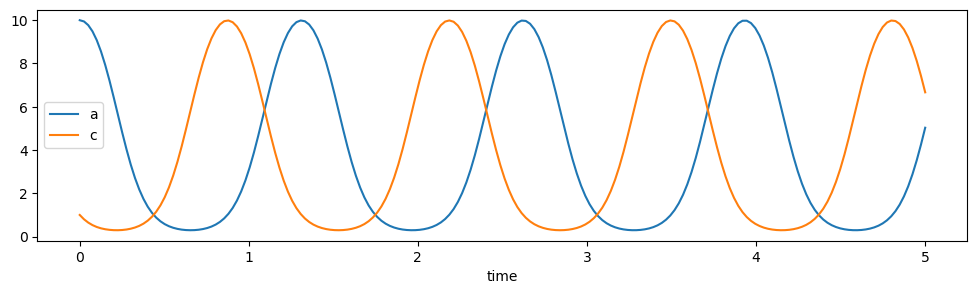

# gpac Python package


## Table of contents

* [Overview](#overview)
* [API](#api)
* [Installation](#installation)
* [Examples](#examples)
  - [Plotting ODEs](#plotting-odes)
  - [Getting trajectory data of ODEs](#getting-trajectory-data-of-odes)
  - [Chemical reaction networks](#chemical-reaction-networks)


## Overview
This is a package for simulating General-Purpose Analog Computers as defined and studied by Claude Shannon. It's primarily a front-end to scipy and sympy making it easier to numerically integrate systems of ODEs and plot their solutions.

**Note:** Some of the relative links below are intended to be used only on the GitHub page for this project: https://github.com/UC-Davis-molecular-computing/gpac#readme  They will not work if you are reading this document on PyPI, for example.

## API
The API for the package is here: https://gpac.readthedocs.io/

## Installation
Python 3.7 or above is required.

1. Install the dependencies by typing  
   ```
   pip install numpy scipy matplotlib sympy
   ```
   at the command line.

2. Clone this repo by typing 
   ```
   git clone https://github.com/UC-Davis-molecular-computing/gpac.git
   ```
   at the command line. You may need to install `git` first: https://git-scm.com/book/en/v2/Getting-Started-Installing-Git

3. Add the directory into which you cloned it to your PYTHONPATH environment variable. See https://www.geeksforgeeks.org/pythonpath-environment-variable-in-python/ for example if you don't know how to do this. After doing this you should be able to import the gpac package in your Python scripts/Jupyter notebooks with `import gpac`. Try testing this out in the Python interpreter:
    ```python
    $ python
    Python 3.9.12 (main, Apr  4 2022, 05:22:27) [MSC v.1916 64 bit (AMD64)] :: Anaconda, Inc. on win32
    Type "help", "copyright", "credits" or "license" for more information.
    >>> import gpac
    >>>
    ```

## Examples
See more examples in the Jupyter notebook [notebook.ipynb](notebook.ipynb).

### Plotting ODEs
The following is an example of what can be done currently, which is simply to numerically integrate and plot a system of ODEs (ordinary differential equations).

The ODEs are specified by creating [sympy](https://www.sympy.org/) symbols and expressions (or if you like, Python strings), represented as a Python dict `odes` mapping each variable---a single sympy symbol or Python string---to an expression representing its time derivative, represented as a sympy expression composed of sympy symbols (or for convenience you can also use Python strings, or if the derivative is constant, a Python `int` or `float`).

Every symbol that appears in any of the expressions *must* also be a key in this dict.

The initial values are specified as a Python dict `initial_values` mapping variables (again, sympy symbols or strings) to their initial values (floats). If you leave out a symbol as a key to `initial_values`, it is assumed to have initial value 0.

Finally, you can specify the times at which to solve for the ODEs as an iterable of floats `t_eval`. (This is optional; if not specified it uses the time values 0.0, 0.01, 0.02, 0.03, ..., 0.98, 0.99, 1.0)

Remaining parameters are optional (see below for examples of them). See docstrings of functions
`integrate_odes` and `plot` in the source code file [gpac.py](gpac/gpac.py) for more details.

```python
import sympy
import gpac
import numpy as np

a,b,c = sympy.symbols('a b c')

# ODEs specified as dict mapping each variable to expression describing its derivative.
# key representing variable can be a sympy Symbol or string.
# value representing derivative can be a sympy Expr, string, or (if constant) int or float.
odes = {
    a: -a*b + c*a, 
    b: -b*c + a*b,
    'c': '-c*a + b*c', 
}
initial_values = {
    a: 10,
    b: 1,
    c: 1,
}
t_eval = np.linspace(0, 3, 200)

gpac.plot(odes, initial_values, t_eval=t_eval, figure_size=(20,4), symbols_to_plot=[a,c])
```



### Getting trajectory data of ODEs
If you want the data itself from the ODE numerical integration (without plotting it), you can call `gpac.integrate_odes` (replace the call to `plot` above with the following code).

```python
t_eval = np.linspace(0, 1, 5)

solution = gpac.integrate_odes(odes, initial_values, t_eval=t_eval)
print(f'times = {solution.t}')
print(f'a = {solution.y[0]}')
print(f'b = {solution.y[1]}')
print(f'c = {solution.y[2]}')
```
which prints
```
times = [0.   0.25 0.5  0.75 1.  ]
a = [10.          4.84701622  0.58753815  0.38765743  3.07392998]
b = [1.         6.84903338 9.63512628 3.03634559 0.38421121]
c = [1.         0.3039504  1.77733557 8.57599698 8.54185881]
```
The value `solution` returned by `gpac.integrate_odes` is the same object returned from [`scipy.integrate.solve_ivp`](https://docs.scipy.org/doc/scipy/reference/generated/scipy.integrate.solve_ivp.html).


### Chemical reaction networks
There are also functions `integrate_crn_odes` and `plot_crn`, which take as input a description of a set of chemical reactions, derives their ODEs, then integrates/plots them. They both use the function `crn_to_odes`, which converts chemical reactions into ODEs.

See [notebook.ipynb](notebook.ipynb) for examples.

Reactions are constructed using operations on `Specie` objects:

```python
# plot solution to ODEs of this CRN that computes f(x) = x^2, using the gpac.crn module
# 2X -> 2X+Y
# Y -> nothing
x,y = gpac.species('X Y')
rxns = [
    x+x >> x+x+y,
    y >> gpac.empty,
]
initial_values = {x:5}
t_eval = np.linspace(0, 5, 100)

# plot trajectory of concentrations
gpac.plot_crn(rxns, initial_values, t_eval=t_eval, figure_size=(20,4))
```

Although they appear similar, a `Specie` object (such as `x` and `y` returned from `gpac.species` above) is different from a `sympy.Symbol` object. The `Specie` object is intended to help specify reactions using the notation above with the symbols `+`, `>>`, and `|` (as well as the `k` and `r` functions for specifying non-unit rate constants, see example [notebook](notebook.ipynb)). However, any of the following objects can be a key in the `initial_values` parameter to `plot_crn` and `integrate_crn_odes`: `Specie`, `sympy.Symbol`, or `str`. They will be normalized to `sympy.Symbol` objects in the ODEs.